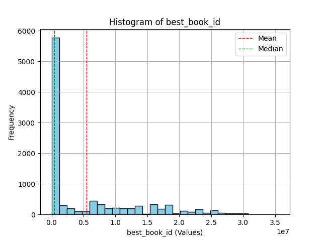
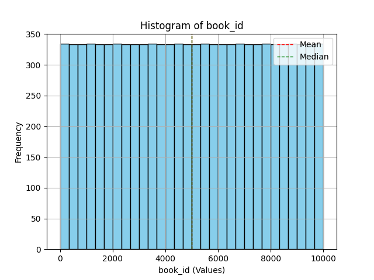
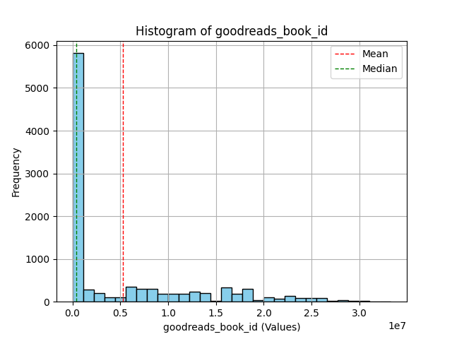

# Dataset Analysis Report

Based on the summary of your dataset, here are insights and suggestions for further analysis:

### 1. Key Patterns and Trends:
- **Author Popularity:** The authors with the highest counts (e.g., Stephen King, Nora Roberts) might indicate their popularity or frequency of books in the dataset. This could prompt further investigation into the number of ratings and average ratings for these authors.
- **Publications Over Time:** The `original_publication_year` shows a wide range, which could allow for exploration of trends over decades. A notable mean of ~1982 suggests that many older books are included. This warrants an analysis into how ratings or reader preferences might have shifted over time.
- **Rating Distribution:** The means of the ratings (1-5) suggest a favorable distribution skewed towards higher ratings, which could indicate a bias in the dataset if most entries are critically acclaimed. Examining the distribution of reviews by star rating could further clarify this.
- **Large Variability in Ratings Count:** The `ratings_count`, `work_ratings_count`, and their standard deviations indicate considerable discrepancy between books. Some books have an extraordinarily high number of ratings, which might skew average values.

### 2. Correlations and Insights:
- **Correlation Analysis:** Conduct a correlation matrix to detect significant linear relationships between numerical features. For example, you can explore the relationship between `average_rating` and `ratings_count` or `work_text_reviews_count`.
- **Ratings Breakdown:** Analyze relationships between different star ratings (`ratings_1`, `ratings_2`, etc.). A comparison of ratings might reveal how many readers rated the book positively or negatively.
- **Impact of Author and Language:** Categorize and explore average ratings and counts by `authors` and `language_code`. This could uncover which authors or languages are trending.

### 3. Addressing Missing Values and Outliers:
- **Missing Values:**
  - For `isbn`, `isbn13`, and `original_publication_year`, consider:
    - Dropping rows if the missing values are relatively few and won’t impact the analysis significantly.
    - Imputing with mean (or median for non-skewed features) or an indicator flag for missing values.
  - For `original_title` and `language_code`, check the percentage of missing data. If large, you may want to analyze whether to drop these columns entirely for specific analyses.
  
- **Potential Outliers:** Use z-score or IQR methods to identify outliers particularly in numerical columns like `average_rating`, `ratings_count`, etc. Depending on their impact, tailor your approach to either exclude them or analyze them separately.

### 4. Additional Analyses:
- **Sentiment Analysis:** If any text reviews are available, conduct sentiment analysis to see the correlation between sentiment scores and average ratings.
- **Time Series Analysis:** If you can extract trends based on `original_publication_year` and their respective ratings over time, this might uncover interesting historical patterns in book reception.
- **Visualizations:** Use visual tools (like scatter plots, box plots, and histograms) to illustrate relationships and distributions effectively.
- **User Segmentation:** If you have access to user metadata or behaviors, analyze how different segments (by age, gender) rate different genres or authors.

### 5. Suggested Actionable Steps:
- **Implement Data Cleaning:** Address the missing data according to the strategies discussed and assess the impact on the dataset.
- **Enhanced Data Collection:** Explore if additional features could be collected, such as genre or reader demographics, to provide a richer dataset for analysis.
- **Model Development:** Depending on your goals, consider developing predictive models (e.g., regression analysis) for predicting book ratings based on numerical features.
- **User Interface Improvements:** If this dataset is part of a larger application or service, consider implementing user features that highlight top-rated authors, trending books over time, and more detailed analyses of author popularity.

By following these structured evaluations and suggestions, you can derive useful insights from your dataset and improve your analysis conclusions.

## Visualizations

