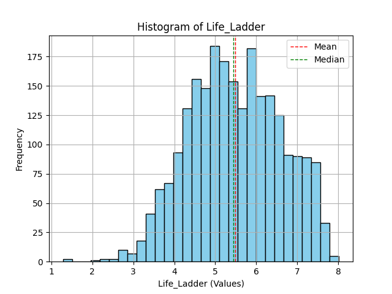
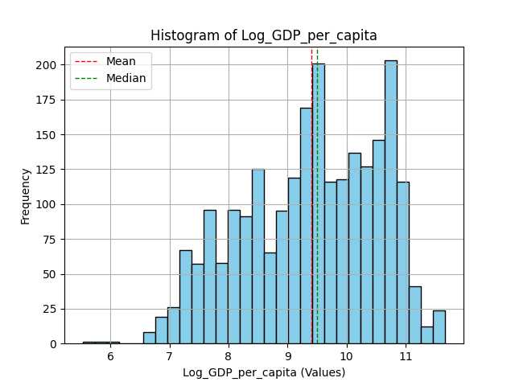
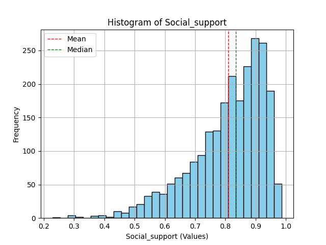

# Dataset Analysis Report

Based on the summary of your dataset, let's explore the questions you have.

### 1. Key Patterns or Trends
- **Temporal Trends**: The 'year' column suggests a relatively recent dataset (mostly post-2005), with the mean year being around 2015. It may be interesting to analyze how the variables have changed over time (e.g., is happiness increasing, as indicated by the Life Ladder, over the years?).
- **Life Ladder Distribution**: With a Life Ladder average of 5.48, the variation indicates differences in life satisfaction across countries. The minimum value, 1.28, suggests some countries might have very low life satisfaction.
- **Economic Indicators**: The correlation between 'Log GDP per capita' and 'Life Ladder' may be significant. Countries with higher GDP generally exhibit better life satisfaction.
- **Social Support**: The average score of 0.81 in 'Social support' appears relatively high, which could imply that social networks are generally strong across the countries in your dataset.

### 2. Specific Correlations or Insights
- **Correlations**: You can conduct correlation analysis to evaluate relationships between numerical columns. Strong correlations might exist between 'Log GDP per capita' and 'Life Ladder', and between 'Social support' and 'Life Ladder'.
- **Categorical Analysis**: The categorical data shows that countries like Argentina, Costa Rica, Brazil, Bolivia, and Bangladesh are frequently represented. A comparative analysis of these countries' average values across the numerical columns may yield insights into regional trends or commonalities that impact life satisfaction.

### 3. Addressing Missing Values and Outliers
- **Missing Values**: Consider imputation strategies based on the nature of the data:
  - **Mean/Median Imputation**: For continuous variables (e.g., Log GDP per capita), you could replace missing values with the mean or median.
  - **Prediction Models**: Use regression or machine learning models to predict missing values based on other features.
- **Outliers Detection**: Use statistical techniques (e.g., Z-score, IQR) to identify outliers. Depending on their significance, you may consider removing or transforming outliers to minimize their impact on analysis.

### 4. Additional Analyses
- **Time Series Analysis**: If the data is organized over the years, a time series analysis could provide insights into trends over time.
- **Cluster Analysis**: Perform clustering to group countries based on similarities in life satisfaction and economic indicators. This could help identify patterns regarding which countries are similar or dissimilar.
- **Regression Analysis**: Build regression models to understand which variables predict 'Life Ladder' and to what extent.
- **Visualizations**: Create visualizations (box plots, scatter plots, heatmaps) to better understand distributions and relationships, which may highlight trends that tables alone may miss.

### 5. Actionable Steps or Improvements
- **Data Cleaning**: Prioritize data cleaning to handle missing values and outliers to ensure the analysis is accurate.
- **Feature Engineering**: Consider creating new features, such as combining 'Positive affect' and 'Negative affect' to create a 'Net affect' score or categorizing 'Log GDP per capita' into discrete ranges (e.g., high, medium, low).
- **Further Exploration**: Perform exploratory data analysis (EDA) to generate hypotheses about relationships and causations within the dataset.
- **Policy Recommendations**: Based on findings, suggest areas for policy interventions (e.g., improving social support or addressing perceptions of corruption) to improve life satisfaction in specific countries.

By following these insights and analyses, you can derive meaningful interpretations from the dataset that may translate into valuable recommendations for researchers, policymakers, or stakeholders interested in understanding life satisfaction across different countries.

## Visualizations

