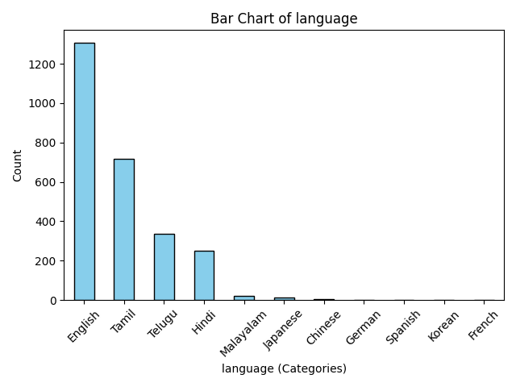
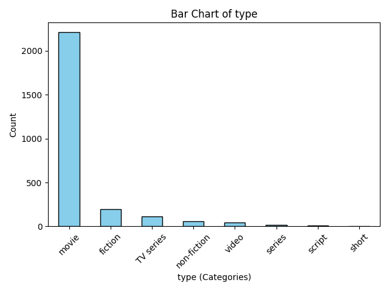

# Dataset Analysis Report

Based on your dataset summary, here are insights and suggestions for analyzing the data:

### 1. Key Patterns or Trends
- **Ratings Distribution**: The numerical columns indicate that both `overall` and `quality` have relatively low means (3.05 and 3.21), suggesting a tendency towards average ratings. The standard deviations imply a moderate spread, indicating diversity in ratings across the dataset.
- **Repeatability Concerns**: The `repeatability` mean (1.49) suggests that most items are rated low on repeatability, which might indicate either low relevance or satisfaction with undergoing viewership again.
- **Language Preference**: The predominant language is English, indicating that resources may heavily favor English content. This may warrant investigating if this impacts overall ratings across languages.
- **Genre Analysis**: The majority of entries fall under the 'movie' category, which accounts for a significant share (2211 out of 2652). This may reflect viewer preferences or a data collection bias towards this type of content.

### 2. Correlations and Insights
- **Numerical Correlations**: You should compute the correlation matrix to see how the `overall`, `quality`, and `repeatability` scores interact. A potential insight could be to check if higher `overall` ratings correlate with higher `quality` ratings.
- **Categorical Insights**: Analyzing the average scores by categorical variables like `language` and `type` can reveal trends. For instance, it might be interesting to compare average ratings for movies vs. TV series and how language impacts those ratings.
- **Temporal Trends**: Analyzing the `date` column can unveil trends over time – whether viewer preferences change, or how average ratings evolve.

### 3. Handling Missing Values and Outliers
- **Missing Values**: For the `date` and `by` columns:
  - **Imputation**: You might consider imputing missing values based on trends (e.g., filling missing `date` values with the mode) or removing incomplete cases if missing data is minimal.
  - **Categorization**: Creating a separate category for missing values in `by` might also help retain data points for analysis without loss.
  
- **Outliers**: Assess the numerical columns for outlier detection using methods like the IQR method or Z-score. If outliers are valid but significantly skewing results, consider adjusting your analysis (e.g., using robust statistical methods).

### 4. Additional Analyses
- **Segmentation Analysis**: Segment data based on `language`, `type`, or `date` to understand differences in ratings.
- **Trend Analysis**: Utilize time series analysis if possible, to detect any seasonal pattern in movie ratings by date.
- **Sentiment Analysis**: If there are text components to the dataset (e.g., user comments), consider performing sentiment analysis to correlate sentiments with numerical ratings.
- **Predictive Modelling**: Leverage machine learning models to predict ratings based on features (e.g., use multiple regression to predict `overall` rating).

### 5. Actionable Steps or Improvements
- **Focus on Completion**: Complete the dataset by addressing missing values with imputation or by considering additional data sources.
- **Data Normalization**: For better analysis, standardize numerical values if comparing different distributions.
- **Categorical Expansions**: Consider expanding the analysis by creating new categories based on user-defined criteria (e.g., good/bad content based on ratings).
- **Visualization**: Create visualizations to identify trends effectively, such as box plots for ratings distribution, bar graphs for categorical distributions, and heatmaps for correlations.
- **User Feedback Loop**: If applicable, implementing a feedback mechanism to post-rating assessments could enhance data quality over time.

### Summary
This analysis framework should guide your exploration of the dataset deeper, identify significant trends or correlations, understand user preferences, and generate actionable insights for further research or business decisions.

## Visualizations

